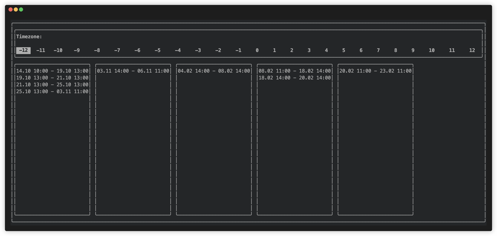
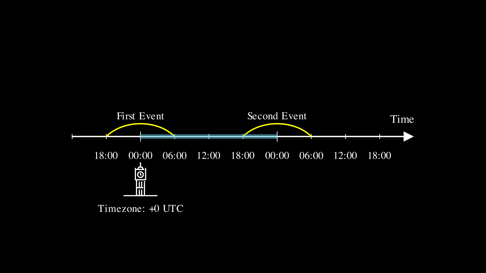
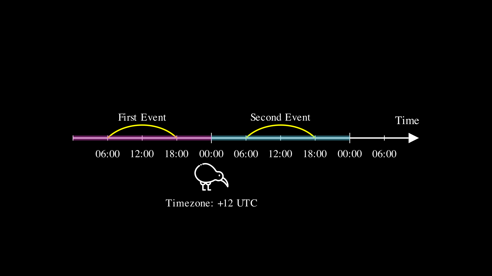

# Chaining dates problem

## Introduction

A couple of months ago I was at an interview, and as a "homework" I was asked to solve the following problem:
There is a list of events scattered across the globe, each has its start and end time. The task is to build chains of events so that in each chain the next event starts on the same date the previous one ends, and display the result in a fancy way (which is out of scope of the article). Edge cases like overlapping events are also out of scope.

Sounds simple, but while discussing a solution we struggled to have a common understanding of what it means for two things to happen on the same day. They were wondering what could be wrong with such a simple and obvious requirement and I failed my roll to convince them that it's much more complicated than it looks like.

So, we have a list that looks like this (order is not guaranteed):
```
{
  "events": [
    {"id": 2, "start": "2026-01-01T18:00:00Z", "end": "2026-01-02T06:00:00Z" },
    {"id": 1, "start": "2025-12-31T18:00:00Z", "end": "2026-01-01T06:00:00Z" },
    {"id": 3, "start": "2026-01-05T14:00:00Z", "end": "2026-01-06T13:00:00Z" }
  ]
}
```
and the result should have a structure like the following:
```
[
    [
        {"id": 1, "start": "2025-12-31T18:00:00Z", "end": "2026-01-01T06:00:00Z" },
        {"id": 2, "start": "2026-01-01T18:00:00Z", "end": "2026-01-02T06:00:00Z" },
    ],
    [
        {"id": 3, "start": "2026-01-05T14:00:00Z", "end": "2026-01-06T13:00:00Z" }
    ]
]
```

## Naive solution

The most obvious approach (and also the one suggested by the interviewers) is to use a calendar to compare dates or convert dates to strings omitting the time component and compare the result:

```
class ChainBuilder {
    
    func process(response: EventsResponse) -> [EventChain] {
        let calendar = Calendar.current
        let events = response.events.sorted { $0.start < $1.start }

        let chains: [[Event]] = events.reduce(into: []) { chains, event in
            let insertIndex = chains.firstIndex(where: { chain in
                 guard let lastEvent = chain.last else {
                    assertionFailure("empty chains should never exist")
                    return false
                }

                return calendar.isDate(lastEvent.end, inSameDayAs: event.start)
            })

            if let insertIndex {
                chains[insertIndex].append(event)
            } else {
                chains.append([event])
            }
        }

        return chains.map { EventChain(events: $0) }
    }
}
```

The huge issue of this solution (or any similar one) is that it uses the current timezone of the user to calculate the result and as the user travels across the world visiting these events, the grouping may change.


## Why it behaves so weirdly

Let's assume that we have two events: 
    - Event 1: `{start: 2025-12-31T18:00:00Z, end: 2026-01-01T06:00:00Z}`
    - Event 2: `{start: 2026-01-01T18:00:00Z, end: 2026-01-02T06:00:00Z}`

Then we have the following imaginary timeline, each tick corresponds to six hours:


In order to start counting days, we need to put the origin point on the line a.k.a. specify a timezone. Let's assume that our user starts in the UK.


Then the first event ends at 6AM Jan 1st and the second one starts at 6PM the same day.
But what if we consider a user who lives in New Zealand?


Then the first event ends at 6PM Dec 31st and the second one starts at 6AM Jan 1st, so we should not chain them! 

And what if the first event takes place in London but the second one in Wellington? Should we split the chain while the user changes flights somewhere in east Asia?

## Conclusion

Like any poorly defined task, this problem lacks a good solution. For me personally, the least frustrating approach is to just chain events if the time between them is within a certain threshold.
But even calculating the difference could not be as straightforward.

**What was intentionally ignored here:**
- Daylight Saving Time
- leap days/hours/seconds
- time inconsistencies in distributed systems
- gravitation effects, extreme velocity and other consequences of living in a curved space-time 
- everything else from the list: https://zenodo.org/records/17070518

P.S>
Kudos to Rens Breur for a fancy terminal UI library: https://github.com/rensbreur/SwiftTUI